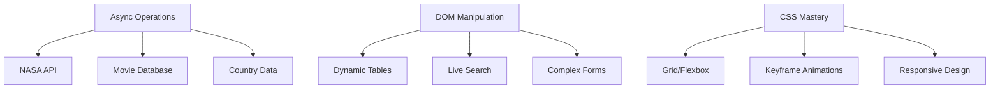
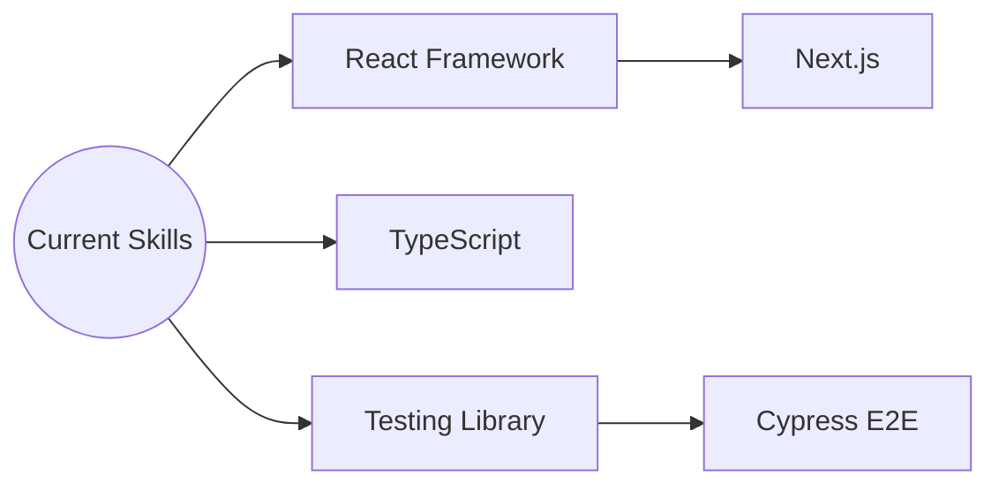

# Frontend Learning Hub 🚀

Repository showcasing advanced front-end development skills through practical implementations and modern techniques.

## 🛠 Current Tech Stack


## 🌟 Key Features

### 🎮 Interactive Components

- Complex API integration with error handling
- Dynamic DOM manipulation with modal systems
- Real-time form validation
- Async/await operations with loading states
- Responsive sidebar navigation with toggle functionality

### 🛠 Core Implementations



## 📂 Project Structure

```plaintext
frontend-portfolio/
├── public/
│   ├── images/          # Project assets
│   └── fonts/           # Custom fonts
├── src/
│   ├── core/            # Fundamental implementations
│   │   ├── animation/   # CSS animations
│   │   ├── dom/         # Advanced DOM manipulation
│   │   └── api/         # API integration samples
│   │
│   ├── projects/        # Complete applications
│   │   ├── pokeapi/     # Pokémon API explorer
│   │   ├── async-lab/   # Async operations playground
│   │   └── gallery/     # Responsive image grid
│   │
│   └── utils/           # Helper utilities
│       ├── css-advanced # Modern CSS techniques
│       └── js-practice  # JavaScript experiments
├── .prettierrc          # Code formatting
└── README.md            # Project documentation
```

## 🚀 Highlighted Projects

### API Integration Lab 🔌

**Features:**

- Multiple API endpoints (NASA, Movies, Countries)
- Error handling with try/catch
- Local storage caching
- Dynamic modal system
- Real-time data filtering

```javascript
// Example async/await implementation
async function fetchNasaData() {
  try {
    const response = await fetch('https://api.nasa.gov/planetary/apod');
    const data = await response.json();
    renderNasaMedia(data);
  } catch (error) {
    showErrorUI(error);
  }
}
```

### Animation Playground 🎨

**Techniques:**

- CSS keyframe animations
- Transform transitions
- Interactive hover states
- Responsive layout transitions
- Complex grid layouts

## 🛠 Development Practices

**Code Quality:**

```bash
# Format all project files
npx prettier --write "**/*.{html,css,js}"

# Lint JavaScript files
eslint src/**/*.js
```

**Git Workflow:**

```bash
# Standard commit pattern
git commit -m "feat: add NASA API integration
- Implement async data fetching
- Add error handling
- Create modal display system"
```

## 🧭 Learning Roadmap



## 🔄 CI/CD Pipeline Implemented by [@Antoineio](https://github.com/Antoineio)

[](https://github.com/GiulioArantes/meu-projeto-didatico/actions)

**Key Implementation:**

- Strict code validation with ESLint + Stylelint
- Test suite with Jest (e.g. `api-integration.test.js`)
- Automated build with Jekyll
- Continuous deployment to GitHub Pages
- Main branch protection
- npm dependency caching
- Job parallelization

## 🤝 Contribution Guidelines

1. Fork the repository
2. Create feature branch:

```bash
git checkout -b feat/improved-search
```

3. Commit changes with semantic messages:

```bash
git commit -m "perf: optimize API calls
- Implement request caching
- Add debounce to search
- Update error handling"

# Verify locally before pushing
npm run lint && npm test
```

4. Open Pull Request with detailed description.
   _Special thanks to @Antoineio for architecting our robust CI/CD pipeline!_

---

**Connect with me:** [](https://www.linkedin.com/in/giulio-arantes/)
_MIT Licensed | Updated: October 2023 🍂_
